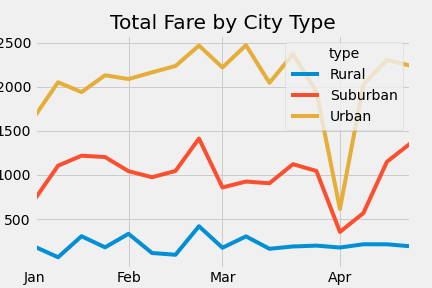

# PyBer_Analysis
Python 3.7.11

# Overview of the Analysis
I created a summary DataFrame of ride-sharing data by city type. This DataFrame shows total rides, total drivers, total fares, average fares per ride, and average fare per driver all by city types. I also created a multiple-line graph that shows the total weekly fares for each city type. This information I am providing allows the data user to understand how fares for each city type impact ride sharing in those cities.  

# Results
The DataFrame and multiple-line graph show that in the Rural city type where there were the least total rides, the average fare per ride and average fare per rider were the highest. In Urban city type where total rides were the highest, average fare per ride and average fare per driver were the lowest. It looks like total fares in city types increased as did the total rides. Please see image below for the DataFrame depicting this.
! [DataFrame](Resources/DataFrame.png)

When looking at the data on a weekly basis through the months of January to April, it looks like generally late February had a spike in total fares in each city type, whereas in early April there was a dip. Please see image below for the graph depicting this.

# Summary
Looking at the results of the data, it is recommended that PyBer try to make ride-sharing in rural cities less expensive. Average fares per rides are about ten dollars higher in rural areas, which might make rural city citizens use PyBer less. It also seems like there are too few drivers in rural areas, whereas in urban areas there are more drivers than rides. It may help to even out these ratios a bit, which could decrease average fare per driver in rual areas. Looking at the graph, it would be a good decision for PyBer to try and lower fares in late april, which could create higher total drives during that week.